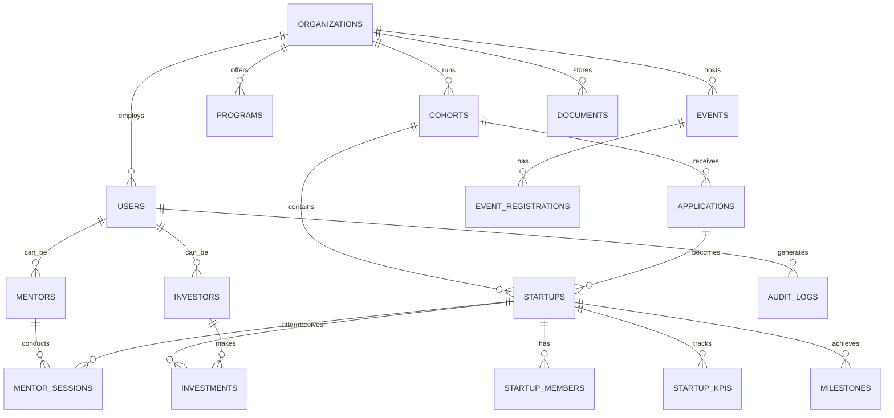

# Incubation Management Platform - Database Schema Design

## Overview

This document outlines the normalized database schema for the Incubation Management Platform, designed to support multi-tenant SaaS architecture with comprehensive audit logging and GDPR compliance.

## Schema Principles

- **Multi-tenant isolation** with organization-based data segregation
- **Normalized design** to minimize redundancy and ensure data integrity
- **Audit trail** for all critical business operations
- **Soft deletes** for data retention and compliance
- **Optimized indexing** for performance at scale
- **GDPR compliance** with data anonymization capabilities

## Core Entity Relationships



## Table Definitions

### 1. Organizations (Multi-tenant Root)

```sql
CREATE TABLE organizations (
    id UUID PRIMARY KEY DEFAULT gen_random_uuid(),
    name VARCHAR(255) NOT NULL,
    slug VARCHAR(100) UNIQUE NOT NULL,
    domain VARCHAR(255),
    logo_url TEXT,
    website_url TEXT,
    description TEXT,
    settings JSONB DEFAULT '{}',
    subscription_plan VARCHAR(50) DEFAULT 'basic',
    subscription_status VARCHAR(20) DEFAULT 'active',
    created_at TIMESTAMP WITH TIME ZONE DEFAULT NOW(),
    updated_at TIMESTAMP WITH TIME ZONE DEFAULT NOW(),
    deleted_at TIMESTAMP WITH TIME ZONE
);

CREATE INDEX idx_organizations_slug ON organizations(slug);
CREATE INDEX idx_organizations_domain ON organizations(domain);
```

### 2. Users (Authentication & Profiles)

```sql
CREATE TABLE users (
    id UUID PRIMARY KEY DEFAULT gen_random_uuid(),
    organization_id UUID NOT NULL REFERENCES organizations(id),
    email VARCHAR(255) UNIQUE NOT NULL,
    password_hash VARCHAR(255),
    first_name VARCHAR(100) NOT NULL,
    last_name VARCHAR(100) NOT NULL,
    avatar_url TEXT,
    phone VARCHAR(20),
    timezone VARCHAR(50) DEFAULT 'UTC',
    locale VARCHAR(10) DEFAULT 'en',
    role VARCHAR(50) NOT NULL,
    permissions JSONB DEFAULT '[]',
    is_active BOOLEAN DEFAULT true,
    email_verified_at TIMESTAMP WITH TIME ZONE,
    last_login_at TIMESTAMP WITH TIME ZONE,
    mfa_enabled BOOLEAN DEFAULT false,
    mfa_secret VARCHAR(255),
    created_at TIMESTAMP WITH TIME ZONE DEFAULT NOW(),
    updated_at TIMESTAMP WITH TIME ZONE DEFAULT NOW(),
    deleted_at TIMESTAMP WITH TIME ZONE
);

CREATE INDEX idx_users_organization_id ON users(organization_id);
CREATE INDEX idx_users_email ON users(email);
CREATE INDEX idx_users_role ON users(role);
```

### 3. Programs & Cohorts

```sql
CREATE TABLE programs (
    id UUID PRIMARY KEY DEFAULT gen_random_uuid(),
    organization_id UUID NOT NULL REFERENCES organizations(id),
    name VARCHAR(255) NOT NULL,
    description TEXT,
    duration_weeks INTEGER,
    application_form_schema JSONB,
    selection_criteria JSONB,
    is_active BOOLEAN DEFAULT true,
    created_at TIMESTAMP WITH TIME ZONE DEFAULT NOW(),
    updated_at TIMESTAMP WITH TIME ZONE DEFAULT NOW()
);

CREATE TABLE cohorts (
    id UUID PRIMARY KEY DEFAULT gen_random_uuid(),
    organization_id UUID NOT NULL REFERENCES organizations(id),
    program_id UUID NOT NULL REFERENCES programs(id),
    name VARCHAR(255) NOT NULL,
    description TEXT,
    start_date DATE NOT NULL,
    end_date DATE NOT NULL,
    application_deadline DATE,
    max_startups INTEGER DEFAULT 20,
    status VARCHAR(20) DEFAULT 'planning',
    created_by UUID NOT NULL REFERENCES users(id),
    created_at TIMESTAMP WITH TIME ZONE DEFAULT NOW(),
    updated_at TIMESTAMP WITH TIME ZONE DEFAULT NOW()
);

CREATE INDEX idx_cohorts_organization_id ON cohorts(organization_id);
CREATE INDEX idx_cohorts_program_id ON cohorts(program_id);
CREATE INDEX idx_cohorts_status ON cohorts(status);
```

### 4. Applications & Startups

```sql
CREATE TABLE applications (
    id UUID PRIMARY KEY DEFAULT gen_random_uuid(),
    organization_id UUID NOT NULL REFERENCES organizations(id),
    cohort_id UUID NOT NULL REFERENCES cohorts(id),
    applicant_email VARCHAR(255) NOT NULL,
    company_name VARCHAR(255) NOT NULL,
    application_data JSONB NOT NULL,
    status VARCHAR(20) DEFAULT 'submitted',
    submitted_at TIMESTAMP WITH TIME ZONE DEFAULT NOW(),
    reviewed_at TIMESTAMP WITH TIME ZONE,
    decision VARCHAR(20),
    decision_reason TEXT,
    score DECIMAL(5,2),
    created_at TIMESTAMP WITH TIME ZONE DEFAULT NOW(),
    updated_at TIMESTAMP WITH TIME ZONE DEFAULT NOW()
);

CREATE TABLE startups (
    id UUID PRIMARY KEY DEFAULT gen_random_uuid(),
    organization_id UUID NOT NULL REFERENCES organizations(id),
    cohort_id UUID REFERENCES cohorts(id),
    application_id UUID REFERENCES applications(id),
    name VARCHAR(255) NOT NULL,
    description TEXT,
    website_url TEXT,
    logo_url TEXT,
    industry VARCHAR(100),
    stage VARCHAR(50),
    founded_date DATE,
    headquarters_location VARCHAR(255),
    employee_count INTEGER,
    business_model VARCHAR(100),
    target_market TEXT,
    status VARCHAR(20) DEFAULT 'active',
    graduation_date DATE,
    created_at TIMESTAMP WITH TIME ZONE DEFAULT NOW(),
    updated_at TIMESTAMP WITH TIME ZONE DEFAULT NOW(),
    deleted_at TIMESTAMP WITH TIME ZONE
);

CREATE TABLE startup_members (
    id UUID PRIMARY KEY DEFAULT gen_random_uuid(),
    startup_id UUID NOT NULL REFERENCES startups(id),
    user_id UUID REFERENCES users(id),
    name VARCHAR(255) NOT NULL,
    email VARCHAR(255) NOT NULL,
    role VARCHAR(100) NOT NULL,
    is_founder BOOLEAN DEFAULT false,
    equity_percentage DECIMAL(5,2),
    joined_at DATE,
    left_at DATE,
    created_at TIMESTAMP WITH TIME ZONE DEFAULT NOW()
);

CREATE INDEX idx_startups_organization_id ON startups(organization_id);
CREATE INDEX idx_startups_cohort_id ON startups(cohort_id);
CREATE INDEX idx_startup_members_startup_id ON startup_members(startup_id);
```

### 5. KPIs & Metrics

```sql
CREATE TABLE kpi_definitions (
    id UUID PRIMARY KEY DEFAULT gen_random_uuid(),
    organization_id UUID NOT NULL REFERENCES organizations(id),
    name VARCHAR(255) NOT NULL,
    description TEXT,
    data_type VARCHAR(20) NOT NULL, -- 'number', 'currency', 'percentage', 'date'
    unit VARCHAR(50),
    category VARCHAR(100),
    is_required BOOLEAN DEFAULT false,
    calculation_formula TEXT,
    created_at TIMESTAMP WITH TIME ZONE DEFAULT NOW()
);

CREATE TABLE startup_kpis (
    id UUID PRIMARY KEY DEFAULT gen_random_uuid(),
    startup_id UUID NOT NULL REFERENCES startups(id),
    kpi_definition_id UUID NOT NULL REFERENCES kpi_definitions(id),
    value DECIMAL(15,2),
    text_value TEXT,
    date_value DATE,
    reporting_period DATE NOT NULL,
    notes TEXT,
    verified_by UUID REFERENCES users(id),
    verified_at TIMESTAMP WITH TIME ZONE,
    created_at TIMESTAMP WITH TIME ZONE DEFAULT NOW(),
    updated_at TIMESTAMP WITH TIME ZONE DEFAULT NOW()
);

CREATE TABLE milestones (
    id UUID PRIMARY KEY DEFAULT gen_random_uuid(),
    startup_id UUID NOT NULL REFERENCES startups(id),
    title VARCHAR(255) NOT NULL,
    description TEXT,
    category VARCHAR(100),
    target_date DATE,
    completed_date DATE,
    status VARCHAR(20) DEFAULT 'pending',
    completion_percentage INTEGER DEFAULT 0,
    assigned_to UUID REFERENCES users(id),
    created_by UUID NOT NULL REFERENCES users(id),
    created_at TIMESTAMP WITH TIME ZONE DEFAULT NOW(),
    updated_at TIMESTAMP WITH TIME ZONE DEFAULT NOW()
);

CREATE INDEX idx_startup_kpis_startup_id ON startup_kpis(startup_id);
CREATE INDEX idx_startup_kpis_reporting_period ON startup_kpis(reporting_period);
CREATE INDEX idx_milestones_startup_id ON milestones(startup_id);
```

### 6. Mentors & Sessions

```sql
CREATE TABLE mentors (
    id UUID PRIMARY KEY DEFAULT gen_random_uuid(),
    user_id UUID NOT NULL REFERENCES users(id),
    organization_id UUID NOT NULL REFERENCES organizations(id),
    bio TEXT,
    expertise_areas TEXT[],
    industries TEXT[],
    years_experience INTEGER,
    hourly_rate DECIMAL(10,2),
    availability_schedule JSONB,
    is_available BOOLEAN DEFAULT true,
    rating DECIMAL(3,2) DEFAULT 0,
    total_sessions INTEGER DEFAULT 0,
    created_at TIMESTAMP WITH TIME ZONE DEFAULT NOW(),
    updated_at TIMESTAMP WITH TIME ZONE DEFAULT NOW()
);

CREATE TABLE mentor_sessions (
    id UUID PRIMARY KEY DEFAULT gen_random_uuid(),
    mentor_id UUID NOT NULL REFERENCES mentors(id),
    startup_id UUID NOT NULL REFERENCES startups(id),
    title VARCHAR(255) NOT NULL,
    description TEXT,
    scheduled_at TIMESTAMP WITH TIME ZONE NOT NULL,
    duration_minutes INTEGER DEFAULT 60,
    meeting_url TEXT,
    meeting_id VARCHAR(255),
    status VARCHAR(20) DEFAULT 'scheduled',
    notes TEXT,
    action_items JSONB,
    rating INTEGER CHECK (rating >= 1 AND rating <= 5),
    feedback TEXT,
    created_at TIMESTAMP WITH TIME ZONE DEFAULT NOW(),
    updated_at TIMESTAMP WITH TIME ZONE DEFAULT NOW()
);

CREATE INDEX idx_mentors_organization_id ON mentors(organization_id);
CREATE INDEX idx_mentor_sessions_mentor_id ON mentor_sessions(mentor_id);
CREATE INDEX idx_mentor_sessions_startup_id ON mentor_sessions(startup_id);
CREATE INDEX idx_mentor_sessions_scheduled_at ON mentor_sessions(scheduled_at);
```

### 7. Events & Training

```sql
CREATE TABLE events (
    id UUID PRIMARY KEY DEFAULT gen_random_uuid(),
    organization_id UUID NOT NULL REFERENCES organizations(id),
    title VARCHAR(255) NOT NULL,
    description TEXT,
    event_type VARCHAR(50) NOT NULL, -- 'workshop', 'seminar', 'demo_day', 'networking'
    start_datetime TIMESTAMP WITH TIME ZONE NOT NULL,
    end_datetime TIMESTAMP WITH TIME ZONE NOT NULL,
    location VARCHAR(255),
    virtual_meeting_url TEXT,
    max_attendees INTEGER,
    registration_deadline TIMESTAMP WITH TIME ZONE,
    is_public BOOLEAN DEFAULT false,
    status VARCHAR(20) DEFAULT 'draft',
    created_by UUID NOT NULL REFERENCES users(id),
    created_at TIMESTAMP WITH TIME ZONE DEFAULT NOW(),
    updated_at TIMESTAMP WITH TIME ZONE DEFAULT NOW()
);

CREATE TABLE event_registrations (
    id UUID PRIMARY KEY DEFAULT gen_random_uuid(),
    event_id UUID NOT NULL REFERENCES events(id),
    user_id UUID REFERENCES users(id),
    startup_id UUID REFERENCES startups(id),
    attendee_name VARCHAR(255) NOT NULL,
    attendee_email VARCHAR(255) NOT NULL,
    registration_data JSONB,
    status VARCHAR(20) DEFAULT 'registered',
    attended BOOLEAN DEFAULT false,
    check_in_time TIMESTAMP WITH TIME ZONE,
    created_at TIMESTAMP WITH TIME ZONE DEFAULT NOW()
);

CREATE INDEX idx_events_organization_id ON events(organization_id);
CREATE INDEX idx_events_start_datetime ON events(start_datetime);
CREATE INDEX idx_event_registrations_event_id ON event_registrations(event_id);
```

### 8. Investments & CRM

```sql
CREATE TABLE investors (
    id UUID PRIMARY KEY DEFAULT gen_random_uuid(),
    organization_id UUID NOT NULL REFERENCES organizations(id),
    user_id UUID REFERENCES users(id),
    name VARCHAR(255) NOT NULL,
    email VARCHAR(255),
    company VARCHAR(255),
    investment_focus TEXT[],
    check_size_min DECIMAL(12,2),
    check_size_max DECIMAL(12,2),
    stage_preferences TEXT[],
    contact_info JSONB,
    notes TEXT,
    status VARCHAR(20) DEFAULT 'active',
    created_at TIMESTAMP WITH TIME ZONE DEFAULT NOW(),
    updated_at TIMESTAMP WITH TIME ZONE DEFAULT NOW()
);

CREATE TABLE investments (
    id UUID PRIMARY KEY DEFAULT gen_random_uuid(),
    startup_id UUID NOT NULL REFERENCES startups(id),
    investor_id UUID NOT NULL REFERENCES investors(id),
    round_type VARCHAR(50) NOT NULL, -- 'pre_seed', 'seed', 'series_a', etc.
    amount DECIMAL(12,2) NOT NULL,
    valuation_pre DECIMAL(12,2),
    valuation_post DECIMAL(12,2),
    equity_percentage DECIMAL(5,2),
    investment_date DATE,
    status VARCHAR(20) DEFAULT 'proposed',
    term_sheet_url TEXT,
    legal_docs_url TEXT,
    notes TEXT,
    created_at TIMESTAMP WITH TIME ZONE DEFAULT NOW(),
    updated_at TIMESTAMP WITH TIME ZONE DEFAULT NOW()
);

CREATE INDEX idx_investors_organization_id ON investors(organization_id);
CREATE INDEX idx_investments_startup_id ON investments(startup_id);
CREATE INDEX idx_investments_investor_id ON investments(investor_id);
```

### 9. Documents & Files

```sql
CREATE TABLE documents (
    id UUID PRIMARY KEY DEFAULT gen_random_uuid(),
    organization_id UUID NOT NULL REFERENCES organizations(id),
    name VARCHAR(255) NOT NULL,
    description TEXT,
    file_path TEXT NOT NULL,
    file_size BIGINT,
    mime_type VARCHAR(100),
    category VARCHAR(100),
    tags TEXT[],
    is_public BOOLEAN DEFAULT false,
    access_permissions JSONB,
    uploaded_by UUID NOT NULL REFERENCES users(id),
    startup_id UUID REFERENCES startups(id),
    event_id UUID REFERENCES events(id),
    version INTEGER DEFAULT 1,
    parent_document_id UUID REFERENCES documents(id),
    created_at TIMESTAMP WITH TIME ZONE DEFAULT NOW(),
    updated_at TIMESTAMP WITH TIME ZONE DEFAULT NOW(),
    deleted_at TIMESTAMP WITH TIME ZONE
);

CREATE INDEX idx_documents_organization_id ON documents(organization_id);
CREATE INDEX idx_documents_startup_id ON documents(startup_id);
CREATE INDEX idx_documents_category ON documents(category);
```

### 10. Audit Logs & Notifications

```sql
CREATE TABLE audit_logs (
    id UUID PRIMARY KEY DEFAULT gen_random_uuid(),
    organization_id UUID NOT NULL REFERENCES organizations(id),
    user_id UUID REFERENCES users(id),
    action VARCHAR(100) NOT NULL,
    resource_type VARCHAR(100) NOT NULL,
    resource_id UUID,
    old_values JSONB,
    new_values JSONB,
    ip_address INET,
    user_agent TEXT,
    created_at TIMESTAMP WITH TIME ZONE DEFAULT NOW()
);

CREATE TABLE notifications (
    id UUID PRIMARY KEY DEFAULT gen_random_uuid(),
    organization_id UUID NOT NULL REFERENCES organizations(id),
    user_id UUID NOT NULL REFERENCES users(id),
    title VARCHAR(255) NOT NULL,
    message TEXT NOT NULL,
    type VARCHAR(50) NOT NULL,
    priority VARCHAR(20) DEFAULT 'normal',
    read_at TIMESTAMP WITH TIME ZONE,
    action_url TEXT,
    metadata JSONB,
    created_at TIMESTAMP WITH TIME ZONE DEFAULT NOW()
);

CREATE INDEX idx_audit_logs_organization_id ON audit_logs(organization_id);
CREATE INDEX idx_audit_logs_user_id ON audit_logs(user_id);
CREATE INDEX idx_audit_logs_created_at ON audit_logs(created_at);
CREATE INDEX idx_notifications_user_id ON notifications(user_id);
CREATE INDEX idx_notifications_read_at ON notifications(read_at);
```

## Sample Migration Scripts

### Initial Setup Migration

```sql
-- Enable UUID extension
CREATE EXTENSION IF NOT EXISTS "pgcrypto";

-- Create enum types
CREATE TYPE user_role AS ENUM ('admin', 'program_manager', 'mentor', 'investor', 'founder', 'support');
CREATE TYPE application_status AS ENUM ('draft', 'submitted', 'under_review', 'accepted', 'rejected', 'waitlisted');
CREATE TYPE startup_status AS ENUM ('active', 'graduated', 'withdrawn', 'suspended');
CREATE TYPE session_status AS ENUM ('scheduled', 'completed', 'cancelled', 'no_show');

-- Create trigger function for updated_at
CREATE OR REPLACE FUNCTION update_updated_at_column()
RETURNS TRIGGER AS $$
BEGIN
    NEW.updated_at = NOW();
    RETURN NEW;
END;
$$ language 'plpgsql';

-- Apply updated_at triggers to relevant tables
CREATE TRIGGER update_organizations_updated_at BEFORE UPDATE ON organizations FOR EACH ROW EXECUTE FUNCTION update_updated_at_column();
CREATE TRIGGER update_users_updated_at BEFORE UPDATE ON users FOR EACH ROW EXECUTE FUNCTION update_updated_at_column();
CREATE TRIGGER update_startups_updated_at BEFORE UPDATE ON startups FOR EACH ROW EXECUTE FUNCTION update_updated_at_column();
```

### Sample Data Seeding

```sql
-- Insert sample organization
INSERT INTO organizations (name, slug, domain, description) VALUES 
('TechStars Demo', 'techstars-demo', 'demo.techstars.com', 'Demo incubator for testing');

-- Insert sample admin user
INSERT INTO users (organization_id, email, first_name, last_name, role) VALUES 
((SELECT id FROM organizations WHERE slug = 'techstars-demo'), 'admin@demo.techstars.com', 'Admin', 'User', 'admin');

-- Insert sample KPI definitions
INSERT INTO kpi_definitions (organization_id, name, description, data_type, unit, category) VALUES 
((SELECT id FROM organizations WHERE slug = 'techstars-demo'), 'Monthly Recurring Revenue', 'MRR in USD', 'currency', 'USD', 'financial'),
((SELECT id FROM organizations WHERE slug = 'techstars-demo'), 'Active Users', 'Number of active users', 'number', 'users', 'product'),
((SELECT id FROM organizations WHERE slug = 'techstars-demo'), 'Burn Rate', 'Monthly cash burn', 'currency', 'USD', 'financial');
```

## Performance Optimization

### Indexing Strategy
- **Primary Keys**: UUID with btree indexes
- **Foreign Keys**: Automatic indexes on all foreign key columns
- **Query Optimization**: Composite indexes on frequently queried column combinations
- **Time-series Data**: Partitioning for KPIs and audit logs by month

### Partitioning
```sql
-- Partition audit_logs by month for performance
CREATE TABLE audit_logs_y2024m01 PARTITION OF audit_logs
FOR VALUES FROM ('2024-01-01') TO ('2024-02-01');
```

### Data Retention & Archival
```sql
-- Archive old audit logs (older than 2 years)
CREATE TABLE audit_logs_archive AS SELECT * FROM audit_logs WHERE created_at < NOW() - INTERVAL '2 years';
DELETE FROM audit_logs WHERE created_at < NOW() - INTERVAL '2 years';

-- Soft delete cleanup for GDPR compliance
UPDATE users SET
    email = 'deleted_' || id || '@deleted.local',
    first_name = 'Deleted',
    last_name = 'User',
    avatar_url = NULL,
    phone = NULL
WHERE deleted_at IS NOT NULL AND deleted_at < NOW() - INTERVAL '30 days';
```

### Security Considerations
- **Row Level Security (RLS)**: Enable for multi-tenant data isolation
- **Encryption**: Sensitive fields encrypted at application level
- **Access Control**: Database users with minimal required permissions
- **Backup Encryption**: All backups encrypted with rotating keys

### Monitoring & Maintenance
- **Query Performance**: pg_stat_statements for slow query identification
- **Index Usage**: Regular analysis of unused indexes
- **Table Bloat**: Automated VACUUM and ANALYZE scheduling
- **Connection Pooling**: PgBouncer for connection management

This schema provides a robust foundation for the incubation management platform with proper normalization, multi-tenant support, comprehensive audit capabilities, and enterprise-grade security and performance considerations.
